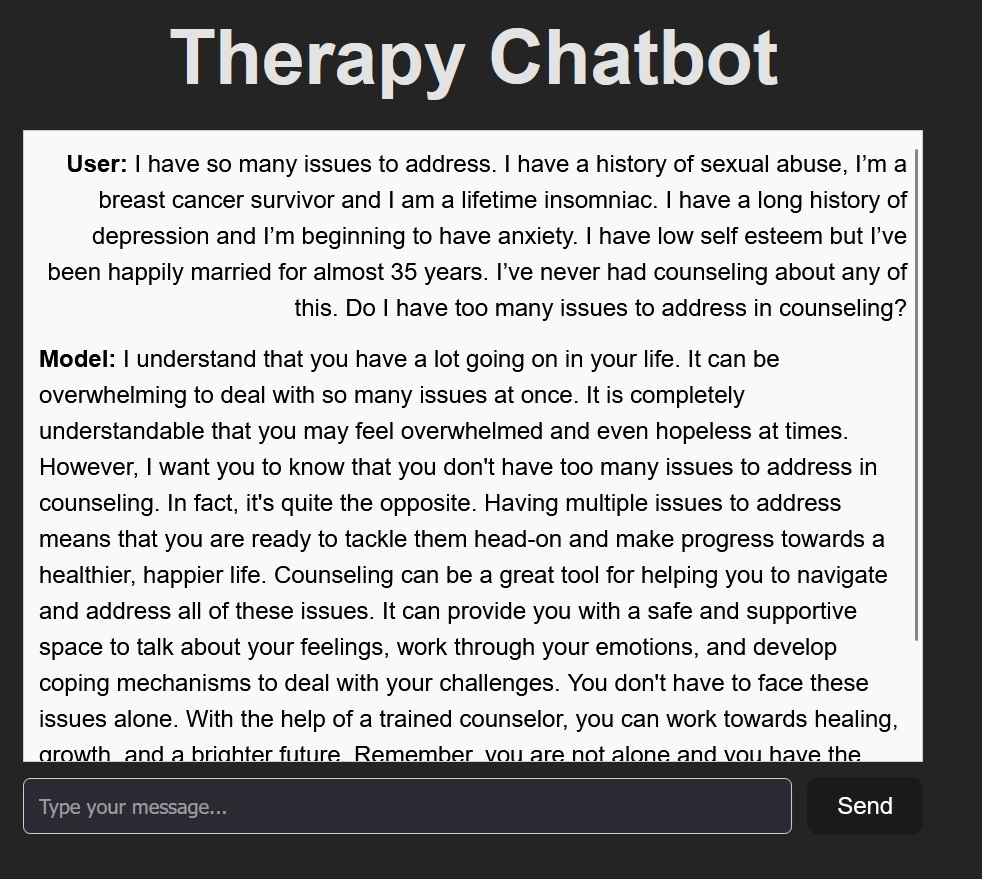

# **Therapy Bot**
This project is an attempt from me to create a therapy bot using data available in huggingFace. It includes finetuning of the model, creating an API out of it as well as contanerizing both the backend and frontend elements. I have chosen this approach because I couldn't find any free online platform which allows gpu based models to be hosted. However, if you have GPU in your personal computer, you should be able to run this setup locally.


_Frontend Sample_


## **Main features**

- Finetuned llama model on therapy dataset. Light weight model that can run locally. 5.7 GB(Base model) + 168 MB(Adapter weights).
- GPU-accelerated inference with Docker and NVIDIA GPUs.
- REST API for model predictions using FastAPI.
- Containerized setup for easy deployment and scalability.

## **Model Details**

I finetuned the 4bit quantized version of llama-3.1-8b LLM using LORA(Low-Rank Adaptation) technique on RishiKompelli/TherapyDataset which you can find in huggingface. I used google collab L4 gpu to finetune this model using unsloth framework. The quantized version with lora technique drastically reduces the time for finetuning. I have included 2 ipynb files. One file describes the process of finetuning the model and another file briefly demonstrates the use of model in collab enviornment.

## **Prerequisites**

- **Docker**: Make sure you have Docker installed on your machine. You can follow the [official Docker installation guide](https://docs.docker.com/get-docker/).
- **NVIDIA GPU Drivers**: Ensure that NVIDIA GPU drivers and CUDA support are set up properly for GPU-accelerated Docker containers.
  - Install the [NVIDIA Container Toolkit](https://docs.nvidia.com/datacenter/cloud-native/container-toolkit/install-guide.html).

## **Project Structure**

```plaintext
├── backend                # Code for setting up the backend container
├── frontend               # Code for setting up a basic frontend container
├── model-training         # Files used for model training
```

## Setup and Installation
### 1. Clone the Repository

Clone the repository to your local machine:

```bash

git clone https://github.com/yourusername/my-model-api.git
cd my-model-api
```

### 2. Create and run Docker Images of frontend and backend
Creating the frontend and backend images are straigforward. However, there is a slight addition to the code required to run the backend container.

    Build the backend image by running:

```bash

docker run --gpus all -p 8000:8000 my-model-api
```

The API will be available at http://localhost:8000.

The frontend container will have to be configured to port 3000 to prevent CORS error. The CORS pipeline for backend app has already been configured.

## API Endpoints

    POST /predict: Send a POST request to this endpoint with input data to get a prediction from the model.
